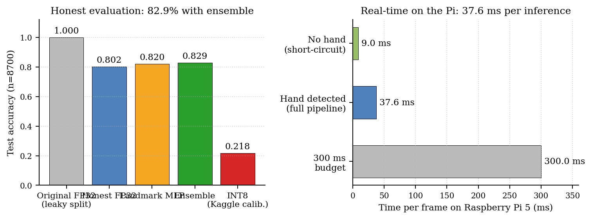

# GestureBridge

Real-time American Sign Language interpreter on a Raspberry Pi 5. Camera in, speech out. No cloud, no internet.

Yizheng Lin, Shufeng Chen. ELEN 6908, Spring 2026.

## Background

Most production sign-language interpreters today depend on cloud inference, which introduces latency, privacy exposure, and a hard requirement for an internet uplink that is not always available in classrooms, clinics, or assistive contexts. GestureBridge runs the entire vision and speech pipeline on a single Raspberry Pi 5 paired with an ESP32 motion sensor, demonstrating that a complete bidirectional ASL interaction system fits comfortably inside the compute budget of a fanless edge device. The system covers the 29-letter ASL alphabet across three modes: gesture to speech, speech to reference image, and an interactive trainer with true or false feedback.

## Results



| Model | Test accuracy | Notes |
|---|---|---|
| Original FP32 (leaky split) | 1.000 | Memorized; not useful |
| Honest FP32 MobileNetV3-Small | 0.802 | First credible baseline |
| Landmark MLP (detected hands) | 0.820 | 63-d MediaPipe vector |
| **Ensemble** | **0.829** | +2.7 pp over MobileNet alone |
| INT8 (Kaggle calibrated) | 0.218 | Distribution mismatch; do not deploy |

On the Raspberry Pi 5, one full inference takes 37.6 ms mean (median 37.7 ms) over 10 runs. Frames with no detected hand short-circuit at 9 ms.

## Three latent bugs we found and fixed

The starting point was a system reporting 100 % held-out accuracy that delivered 0.08 confidence on the actual webcam. Three bugs combined to produce that gap.

1. **Frame leakage.** `train_test_split(stratify=y)` on the Kaggle ASL Alphabet (3,000 sequential frames per class) puts adjacent video frames into both train and test. The model memorized the recording. Fix: contiguous-block split, frames 1 to 2400 train, 2401 to 2700 val, 2701 to 3000 test.
2. **ASL-incorrect flip augmentation.** `tf.image.random_flip_left_right` breaks chirality-sensitive signs (J, L, J/Z trajectory). Fix: removed the flip, added small crop-pad and hue jitter.
3. **Distribution mismatch at inference.** Kaggle images are 200×200 hand-filled squares; C270 frames are 640×480 with the hand at roughly 20 % of area. Fix: insert MediaPipe HandLandmarker, crop a 25 % padded ROI, resize to 224×224 before MobileNet.

## System

```
C270 camera  ->  MediaPipe HandLandmarker
                     |
                     +-- no hand  ->  "nothing"           [ 9 ms]
                     |
                     +-- hand     ->  crop+resize 224     [38 ms]
                                          |
                                          +--  MobileNetV3-Small (TFLite FP32)
                                          +--  Landmark MLP (63-d, sklearn -> npz)
                                                          |
                                                          +-->  ensemble label
```

Web UI on `localhost:8080` with three modes:

- **Read.** Camera, ensemble label, TTS playback.
- **Speech-to-sign.** Two-step record button, offline Vosk on the C270 mic, reference image lookup.
- **Trainer.** Random target letter, spoken true or false feedback.

An ESP32 with a PIR sensor wakes and idles the app via USB serial.

## Reproduction

```bash
# Dataset
kaggle datasets download grassknoted/asl-alphabet

# Contiguous split
python scripts/prepare_asl29.py --split-mode contiguous

# Train sweep on a CUDA box (~25 min on RTX 4090)
bash scripts/vastai_train.sh

# Train the landmark MLP (CPU, under 5 min)
python scripts/train_landmark_mlp.py

# Evaluate the ensemble
python scripts/eval_ensemble.py \
  --mobilenet artifacts/asl29/tflite/model_fp32.tflite \
  --landmark-mlp artifacts/asl29/landmark_mlp/landmark_mlp.npz \
  --split-csv data/asl29/splits/test.csv

# Deploy to the Pi
PI_PASS=<password> bash scripts/deploy_to_pi.sh
```

## Repository layout

```
src/gesturebridge/   core app (pipelines, web UI, daemon, config)
scripts/             training, eval, export, deploy, diagnostics
artifacts/asl29/     model outputs and eval JSONs
data/asl29/          dataset split manifests
notes/               run logs, meeting notes, Pi validation photos
tests/               pytest suite
```

## Environment

Python 3.11 on the Mac for development, training, and export. On the Pi the runtime uses `ai_edge_litert` and `mediapipe`; do not install full TensorFlow on the Pi because its protobuf dependency conflicts with mediapipe.

```bash
# Mac side (development)
python3 -m venv .venv311
source .venv311/bin/activate
pip install -e ".[dev,ml]"

# Pi side (runtime only)
pip install ai_edge_litert==2.1.4 mediapipe==0.10.18
```

## Hardware

Raspberry Pi 5 (8 GB), Logitech C270 USB webcam, USB speaker, ESP32-WROOM-32 with HC-SR501 PIR, 7-inch HDMI LCD. Powered from the Pi USB-C PSU.
