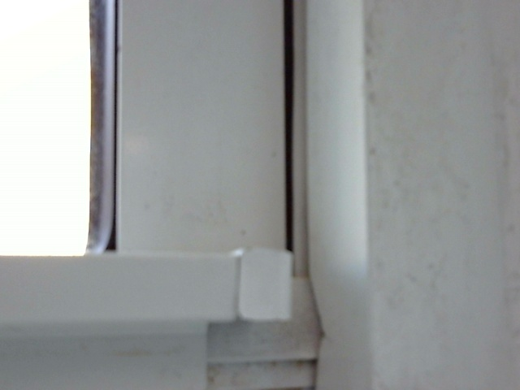

<!-- _class: lead -->
# **GestureBridge**
### Real-time ASL recognition on a Raspberry Pi 5

Yizheng Lin · Shufeng Chen
ELEN 6908 · Spring 2026

---

## What we built

- A Pi-5 that **reads ASL letters** from a USB webcam and **speaks them**
- Three modes in a kiosk web UI:
  - **Read** — camera → ensemble label + confidence on screen → TTS
  - **Speech-to-sign** — offline Vosk STT (C270 mic) → reference image
  - **Trainer** — target letter + spoken "true"/"false" feedback
- **ESP32** PIR sensor wakes / sleeps the app on its own



---

## The problem we found

> *"Test accuracy is 100% — but on the camera almost nothing crosses
>  0.65, even the easy gestures are at 0.08–0.09."*
> — Yizheng's first WeChat to me

A **20-point gap** between the metric and reality.
Three latent bugs hiding in plain sight:

1. **Train/test split** leaks adjacent video frames
2. **Horizontal flip** augmentation is wrong for ASL
3. **No hand-crop** at inference → distribution mismatch with Kaggle

---

## Bug #1 — Frame leakage in the split

- Kaggle ASL Alphabet = **3,000 sequential frames per class**, single signer
- `train_test_split(..., stratify=y)` puts adjacent frames into both halves
- Model memorizes the recording → **100% on its own test, 0% generalization**

**Fix** — *contiguous-block split:* frames 1–2400 train · 2401–2700 val · 2701–3000 test, never adjacent.

```python
# scripts/prepare_asl29.py
parser.add_argument("--split-mode",
    choices=["random", "contiguous"], default="contiguous")
```

---

## Bug #2 — ASL-incorrect flip

- Default TF augmentation: `tf.image.random_flip_left_right`
- For ASL: **J vs L**, J/Z trajectory, every chirality-sensitive sign breaks
- The model is told "left and right are the same" → wrong

**Fix** — remove the flip. Add small crop+pad jitter (~8 %) and hue jitter (±0.05) instead.

---

## Bug #3 — Distribution mismatch at inference

| Kaggle train image | Real C270 frame |
|---|---|
| 200×200, hand-filled | 640×480, hand ~20 % of area |
| Uniform black background | Lab background, motion, lighting |

Model trained on the left, deployed on the right → 0.08 confidence.

**Fix** — **MediaPipe HandLandmarker → crop ROI → 224×224** before MobileNet.
If no hand: **short-circuit to `nothing`** (saves 30 ms, no spurious labels).

---

## New pipeline

```
C270 → MediaPipe HandLandmarker
        ├── (no hand) → "nothing"     [9 ms]
        └── (hand)    → crop+resize → MobileNetV3-Small  [38 ms]
                                   ↓
                                   ├── label, confidence
                                   └── 21×3 landmarks → 63-d MLP
                                                       ↓
                                                       ensemble
```

- MobileNet trained on full Kaggle image (matches training)
- Landmark MLP catches **geometric** structure (B vs D, M vs N)

---

## Sweep on rented vast.ai 4090 (~25 min total)

| tag | unfreeze | dropout | val acc |
|---|---|---|---|
| c_u15_d20 | 15 | 0.2 | 0.799 |
| c_u30_d20 | 30 | 0.2 | 0.874 |
| **c_u50_d20** | **50** | **0.2** | **0.886** |
| c_u30_d30 | 30 | 0.3 | 0.870 |

Winner: **c_u50_d20 → FP32 TFLite, 3.7 MB.**

---

## Honest results — leakage-free test (n = 8,700)

| Model | Test acc | Notes |
|---|---|---|
| Original FP32 (leaky split) | **1.000** | Memorized — useless |
| New FP32 MobileNet | **0.802** | First honest baseline |
| Landmark MLP (detected) | 0.820 | 54 % hand-detect coverage |
| **Ensemble** | **0.829** | **+2.7 pp over MN alone** |
| INT8 (Kaggle-calibrated) | 0.218 | **DO NOT deploy** |

> Demo headline: **82.9 %** at 37.6 ms / frame on the Pi.

---

## Why INT8 broke

- Calibration data: **Kaggle train images** (uniform black, hand-filled)
- Deployment: **C270 frames** (lab background, hand 20% of area)
- Quant scales collapse → predicts mostly "F" or "space"

**Solution path** (not done — not needed for demo):
- `scripts/capture_calibration_set.py` already written
- 500 real C270 frames → re-export → expect <2 pp drop from FP32

Yizheng's call: **"FP32 on Pi is fine, no need to quantize."** ✓

---

## On the Pi — measured

- **37.6 ms / frame** (mean of 10 runs, real lab C270 frame)
- **9 ms / frame** when no hand → short-circuit
- Cadence: 300 ms scheduling → ~25× headroom
- Memory: model 3.7 MB + landmark MLP 0.2 MB + MediaPipe 7.5 MB

```
predict OK: label=nothing conf=1.000 hand_detected=False
latency: mean=37.6ms median=37.7ms
```

---

## Engineering details worth a mention

- **No TF on the Pi.** MediaPipe needs `protobuf<5`, TF 2.21 needs
  `>=6.31` → uninstalled TF, runtime uses `ai_edge_litert` only.
- **Landmark MLP is sklearn-trained, numpy-served.** 199 KB `.npz`,
  <1 ms inference, no TFLite dep at all.
- **Non-destructive deploy.** `scripts/deploy_to_pi.sh` backs up the
  Pi's current `artifacts/` to `/tmp/` before rsync.

---

## What we'd do with another week

- **C270 calibration → INT8** (3× smaller, 2× faster)
- **Multi-signer dataset** — single-signer Kaggle is the next threat to validity
- **Temporal model** for the trajectory signs (J, Z) currently confused with `nothing`
- **Confidence calibration** on real C270 to settle the threshold (currently 0.4 default)

---

<!-- _class: lead -->
# Thank you
### Q&A

GitHub: `yl6079/GestureBridge` (branch `shufeng`)
